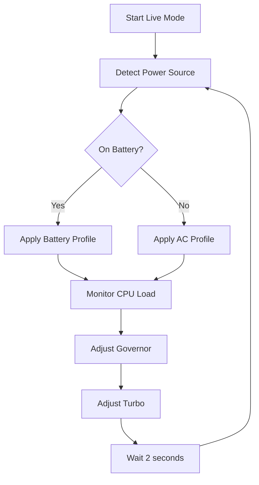

# Live Mode

The `--live` command makes temporary CPU optimizations in real-time, allowing you to test auto-cpufreq's behavior before installing the permanent daemon.

## Usage

```bash
sudo auto-cpufreq --live
```

<Warning>
Changes made in live mode are temporary and will be lost when you exit the command or reboot your system.
</Warning>

## What It Does

Live mode:

1. **Monitors** your system continuously (like `--monitor`)
2. **Applies** CPU optimizations automatically based on:
   - Battery state (AC power vs battery)
   - CPU usage and load
   - CPU temperature
   - System load
3. **Updates** optimizations every 2 seconds
4. **Displays** live statistics showing changes being made

## How It Works



<Info>
Live mode temporarily disables conflicting services (GNOME Power Profiles, TuneD) and re-enables them when you exit.
</Info>

## Example Session

```bash
$ sudo auto-cpufreq --live

------------------------------ auto-cpufreq -------------------------------

Automatic CPU speed & power optimizer for Linux

[System information displayed]

------------------- CPU Optimizations Applied (Battery) ------------------

Governor: powersave (applied)
Scaling min frequency: 400 MHz
Scaling max frequency: 1800 MHz
Turbo: Disabled (applied)

------------------------------ Live Stats ---------------------------------

Optimizations running...
Press Ctrl+C to exit
```

## When to Use Live Mode

<CardGroup cols={2}>
  <Card title="Testing Before Install" icon="flask">
    Verify auto-cpufreq works correctly on your system before permanent installation
  </Card>
  <Card title="Evaluating Impact" icon="chart-mixed">
    Measure battery life or performance improvements with real-time optimizations
  </Card>
  <Card title="Temporary Boost" icon="rocket">
    Get optimizations for a single session without permanent installation
  </Card>
  <Card title="Configuration Testing" icon="sliders">
    Test different configuration file settings before committing
  </Card>
</CardGroup>

## Using with Custom Config

```bash
sudo auto-cpufreq --live --config /path/to/config.conf
```

This applies your custom configuration temporarily.

## Exiting Live Mode

To stop live mode:

1. Press `Ctrl+C`
2. auto-cpufreq will:
   - Stop making optimizations
   - Re-enable conflicting services (if they were running)
   - Restore CPU settings

<Note>
All changes made in live mode are lost after exiting. Your system will return to its previous state.
</Note>

## Live Mode Behavior

### On AC Power
- Governor: `performance` or configured governor
- Turbo: Enabled (with temperature management)
- Scaling: Higher frequencies allowed

### On Battery
- Governor: `powersave` or configured governor  
- Turbo: Disabled or managed automatically
- Scaling: Lower frequencies to save power

### Temperature Management

Live mode monitors CPU temperature and automatically:
- Disables turbo if temperature exceeds 70°C
- Re-enables turbo when temperature drops below 65°C
- Adjusts frequency scaling if overheating persists

## Performance Impact

<Info>
Live mode uses minimal system resources. The optimization daemon runs in the background and only makes changes when needed.
</Info>

## Troubleshooting

<AccordionGroup>
  <Accordion title="Live mode doesn't start">
    Check if the daemon is already running:
    ```bash
    systemctl status auto-cpufreq
    ```
    
    If running, stop it first:
    ```bash
    sudo auto-cpufreq --remove
    ```
  </Accordion>
  
  <Accordion title="No changes being applied">
    Verify you're running with `sudo` and check for conflicting services:
    ```bash
    systemctl status power-profiles-daemon
    systemctl status tlp
    ```
  </Accordion>
  
  <Accordion title="System feels slower">
    This is normal on battery - auto-cpufreq prioritizes battery life. You can force performance mode:
    ```bash
    sudo auto-cpufreq --force=performance --live
    ```
  </Accordion>
</AccordionGroup>

## Comparison with Other Modes

| Feature | Monitor | Live | Daemon |
|---------|---------|------|--------|
| Makes changes | No | Yes | Yes |
| Changes persist | N/A | No | Yes |
| Survives reboot | N/A | No | Yes |
| Runs continuously | No | Yes | Yes |
| Best for | Preview | Testing | Production |

## Related Commands

<CardGroup cols={2}>
  <Card title="Monitor Mode" icon="eye" href="/commands/monitor">
    Preview optimizations without changes
  </Card>
  <Card title="Install Daemon" icon="download" href="/commands/install">
    Make optimizations permanent
  </Card>
  <Card title="Force Governor" icon="gauge-high" href="/commands/force">
    Override automatic governor selection
  </Card>
  <Card title="Turbo Override" icon="bolt" href="/commands/turbo">
    Control turbo boost behavior
  </Card>
</CardGroup>
