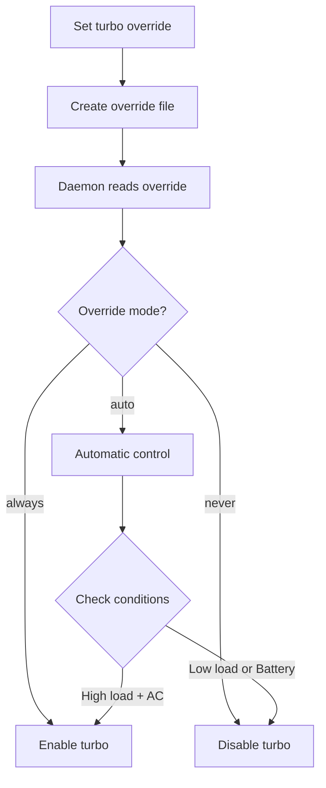

# Turbo Boost Override

The `--turbo` command allows you to manually control CPU turbo boost behavior, overriding auto-cpufreq's automatic turbo management.

## Usage

```bash
# Force turbo always on
sudo auto-cpufreq --turbo=always

# Force turbo always off
sudo auto-cpufreq --turbo=never

# Return to automatic mode (default)
sudo auto-cpufreq --turbo=auto
```

<Warning>
Turbo overrides persist across reboots until explicitly reset. The daemon must not be running when setting overrides.
</Warning>

## Available Modes

<CardGroup cols={3}>
  <Card title="Always" icon="bolt">
    Turbo boost permanently enabled for maximum performance
  </Card>
  <Card title="Never" icon="bolt-slash">
    Turbo boost permanently disabled for battery life and lower temps
  </Card>
  <Card title="Auto" icon="wand-magic-sparkles">
    Automatic management based on load, temperature, and battery state (default)
  </Card>
</CardGroup>

## Auto Mode (Default)

```bash
sudo auto-cpufreq --turbo=auto
```

In auto mode, auto-cpufreq intelligently manages turbo boost:

### On AC Power
- Enabled when CPU load is high
- Disabled when temperature exceeds 70°C
- Re-enabled when temperature drops below 65°C
- Considers both performance needs and thermal limits

### On Battery
- Generally disabled to save power
- May enable briefly for high-demand tasks
- Disabled when battery is low
- Prioritizes battery life over performance

<Info>
Auto mode provides the best balance between performance, battery life, and thermal management.
</Info>

## Always Mode

```bash
sudo auto-cpufreq --turbo=always
```

**What it does:**
- Enables turbo boost permanently
- CPU can reach maximum frequencies
- Applied regardless of battery state or temperature

**Use cases:**
- Gaming or intensive workloads
- Benchmarking
- Video encoding
- Compilation tasks
- When maximum performance is needed

**Impact:**
- ⚡ Maximum CPU performance
- 🔋 Significantly reduced battery life (30-50% less)
- 🌡️ Higher temperatures (10-20°C increase)
- 📊 2-3x higher power consumption
- 🔊 Louder fan noise

<Warning>
Always mode can cause thermal throttling if cooling is inadequate. Monitor temperatures with `auto-cpufreq --stats`.
</Warning>

## Never Mode

```bash
sudo auto-cpufreq --turbo=never
```

**What it does:**
- Disables turbo boost permanently
- CPU limited to base frequency
- Applied even on AC power

**Use cases:**
- Maximum battery life
- Reducing heat in summer or hot environments
- Quiet operation (minimal fan noise)
- Thermal throttling issues
- Older laptops with cooling problems

**Impact:**
- 🔋 Maximum battery life (20-40% improvement)
- ❄️ Significantly lower temperatures
- 🔇 Very quiet operation
- 🐌 Reduced performance (20-40% slower)
- ⚡ 50-70% lower power consumption

<Tip>
Never mode is excellent for extending battery life on long flights or when performance isn't critical.
</Tip>

## How It Works

Turbo boost override is stored in `/opt/auto-cpufreq/turbo-override.pickle`:



## Checking Current Setting

View current turbo state:

```bash
# Via stats
auto-cpufreq --stats

# Direct file check (Intel)
cat /sys/devices/system/cpu/intel_pstate/no_turbo
# 0 = turbo enabled, 1 = turbo disabled

# Direct file check (AMD)
cat /sys/devices/system/cpu/cpufreq/boost
# 1 = turbo enabled, 0 = turbo disabled
```

## Setting Override with Daemon

If the daemon is running:

<Steps>
  <Step title="Stop daemon">
    ```bash
    sudo systemctl stop auto-cpufreq
    ```
  </Step>
  
  <Step title="Set turbo override">
    ```bash
    sudo auto-cpufreq --turbo=always
    ```
  </Step>
  
  <Step title="Start daemon">
    ```bash
    sudo systemctl start auto-cpufreq
    ```
  </Step>
  
  <Step title="Verify">
    ```bash
    auto-cpufreq --stats
    ```
  </Step>
</Steps>

## Platform-Specific Behavior

<Tabs>
  <Tab title="Intel (intel_pstate)">
    Turbo control via:
    ```bash
    /sys/devices/system/cpu/intel_pstate/no_turbo
    ```
    
    - Write `1` to disable turbo
    - Write `0` to enable turbo
  </Tab>
  
  <Tab title="AMD (amd-pstate)">
    Turbo control via:
    ```bash
    /sys/devices/system/cpu/cpufreq/boost
    ```
    
    - Write `0` to disable turbo  
    - Write `1` to enable turbo
  </Tab>
  
  <Tab title="ACPI (acpi-cpufreq)">
    Turbo control via:
    ```bash
    /sys/devices/system/cpu/cpufreq/boost
    ```
    
    Compatible with both Intel and AMD CPUs.
  </Tab>
</Tabs>

## Combining with Governor Override

Combine turbo and governor overrides for fine-grained control:

```bash
# Maximum performance
sudo auto-cpufreq --force=performance
sudo auto-cpufreq --turbo=always

# Maximum battery savings
sudo auto-cpufreq --force=powersave
sudo auto-cpufreq --turbo=never

# Balanced (let auto-cpufreq decide)
sudo auto-cpufreq --force=reset
sudo auto-cpufreq --turbo=auto
```

## Configuration File Alternative

You can also set turbo mode in `/etc/auto-cpufreq.conf`:

```ini
[charger]
governor = performance
turbo = auto  # or always, never

[battery]
governor = powersave
turbo = auto  # or always, never
```

**Priority order:**
1. Command-line `--turbo` override (highest)
2. Configuration file setting
3. auto-cpufreq automatic mode (default)

## Performance Impact

| Mode | CPU Speed | Battery Life | Temperature | Use Case |
|------|-----------|--------------|-------------|----------|
| always | +30-40% | -40% | +15°C | Gaming, rendering |
| auto | Normal | Normal | Normal | Everyday use |
| never | -20% | +30% | -10°C | Maximum battery |

## Troubleshooting

<AccordionGroup>
  <Accordion title="Daemon must not be running error">
    Stop the daemon before setting override:
    ```bash
    sudo systemctl stop auto-cpufreq
    sudo auto-cpufreq --turbo=always
    sudo systemctl start auto-cpufreq
    ```
  </Accordion>
  
  <Accordion title="Turbo not working (Intel)">
    Check if turbo is supported:
    ```bash
    cat /sys/devices/system/cpu/intel_pstate/turbo_pct
    ```
    
    If file doesn't exist, your CPU may not support turbo boost.
  </Accordion>
  
  <Accordion title="Turbo not working (AMD)">
    Verify boost is available:
    ```bash
    cat /sys/devices/system/cpu/cpufreq/boost
    ```
    
    Check BIOS settings - turbo may be disabled in BIOS.
  </Accordion>
  
  <Accordion title="Turbo automatically disabled at high temps">
    This is normal behavior in auto mode. auto-cpufreq disables turbo when CPU temperature exceeds 70°C to prevent overheating.
    
    To force turbo even at high temps (not recommended):
    ```bash
    sudo auto-cpufreq --turbo=always
    ```
  </Accordion>
  
  <Accordion title="Cannot reset turbo override">
    Manually delete the override file:
    ```bash
    sudo rm /opt/auto-cpufreq/turbo-override.pickle
    sudo systemctl restart auto-cpufreq
    ```
  </Accordion>
</AccordionGroup>

## Best Practices

<CardGroup cols={2}>
  <Card title="Daily Use" icon="laptop">
    ```bash
    sudo auto-cpufreq --turbo=auto
    ```
    Let auto-cpufreq optimize automatically
  </Card>
  <Card title="Gaming Session" icon="gamepad">
    ```bash
    sudo auto-cpufreq --turbo=always
    sudo auto-cpufreq --force=performance
    ```
    Maximum performance
  </Card>
  <Card title="Travel/Battery" icon="plane">
    ```bash
    sudo auto-cpufreq --turbo=never
    sudo auto-cpufreq --force=powersave
    ```
    Maximum battery life
  </Card>
  <Card title="Overheating Issues" icon="temperature-high">
    ```bash
    sudo auto-cpufreq --turbo=never
    ```
    Reduce heat generation
  </Card>
</CardGroup>

## Monitoring Turbo Impact

Monitor the effect of turbo settings:

```bash
# Watch stats in real-time
watch -n 1 auto-cpufreq --stats

# Monitor temperature
watch -n 1 sensors

# Track battery drain
upower -i /org/freedesktop/UPower/devices/battery_BAT0
```

## Related Commands

<CardGroup cols={2}>
  <Card title="Force Governor" icon="gauge-high" href="/commands/force">
    Override CPU governor selection
  </Card>
  <Card title="Stats" icon="chart-line" href="/commands/stats">
    View current turbo state
  </Card>
  <Card title="Config File" icon="file-lines" href="/configuration/config-file">
    Configure turbo in config file
  </Card>
  <Card title="Turbo Boost Concepts" icon="book" href="/concepts/turbo-boost">
    Learn how turbo boost works
  </Card>
</CardGroup>
