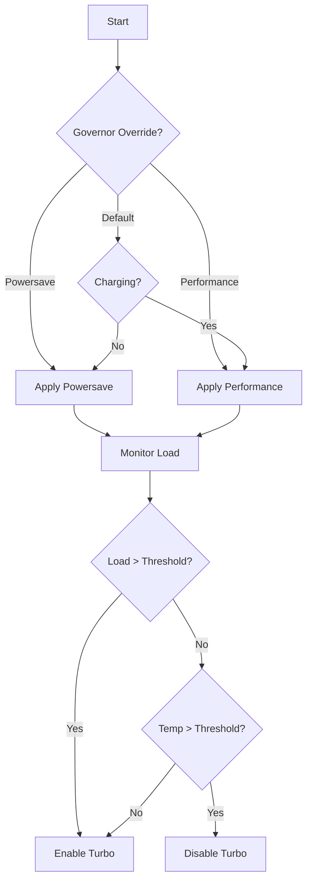

## Overview

auto-cpufreq automatically optimizes CPU frequency scaling and power management on Linux by monitoring system state and making intelligent decisions about CPU governors, frequencies, and turbo boost settings.

## Core Algorithm

The optimization process follows this decision flow:

<Steps>
  <Step title="Detect Power Source">
    Check if the device is charging or on battery power
  </Step>
  <Step title="Monitor System State">
    Measure CPU load, temperature, and system load average
  </Step>
  <Step title="Apply Governor">
    Select and apply the appropriate CPU governor
  </Step>
  <Step title="Configure Turbo Boost">
    Enable or disable turbo boost based on current conditions
  </Step>
</Steps>

## Power Source Detection

auto-cpufreq determines the power state by checking `/sys/class/power_supply/` entries:

<CodeGroup>
```python core.py:262-298
def charging():
    """
    get charge state: is battery charging or discharging
    """
    power_supplies = sorted(os.listdir(Path(POWER_SUPPLY_DIR)))
    
    for supply in power_supplies:
        power_supply_type_path = Path(POWER_SUPPLY_DIR + supply + "/type")
        with open(power_supply_type_path) as f: 
            supply_type = f.read()[:-1]

        if supply_type == "Mains":
            # we found an AC
            power_supply_online_path = Path(POWER_SUPPLY_DIR + supply + "/online")
            with open(power_supply_online_path) as f:
                if int(f.read()[:-1]) == 1: 
                    return True # we are definitely charging
        elif supply_type == "Battery":
            power_supply_status_path = Path(POWER_SUPPLY_DIR + supply + "/status")
            with open(power_supply_status_path) as f:
                if str(f.read()[:-1]) == "Discharging": 
                    return False

    return True # cannot determine, assume charging
```
</CodeGroup>

### Power State Logic

- **AC Power Detected**: Returns `True` if any "Mains" type power supply shows `online=1`
- **Battery Discharging**: Returns `False` if any battery shows status "Discharging"
- **Default Behavior**: Assumes charging if state cannot be determined (e.g., on desktops)

<Note>
  You can ignore specific power supplies (like gaming controllers) using the `[power_supply_ignore_list]` section in your config file.
</Note>

## CPU Load Monitoring

auto-cpufreq continuously monitors multiple metrics to make optimization decisions:

<CardGroup cols={2}>
  <Card title="CPU Usage" icon="gauge-high">
    Total CPU utilization percentage measured using `psutil.cpu_percent()`
  </Card>
  <Card title="System Load" icon="chart-line">
    1-minute load average from `os.getloadavg()` compared against thresholds
  </Card>
  <Card title="Per-Core Usage" icon="microchip">
    Individual core utilization to detect single-threaded workloads
  </Card>
  <Card title="Temperature" icon="temperature-high">
    Average temperature across all CPU cores from thermal sensors
  </Card>
</CardGroup>

### Load Thresholds

The system uses CPU-count-relative thresholds defined in `core.py:42-44`:

```python
performance_load_threshold = (50 * CPUS) / 100
powersave_load_threshold = (75 * CPUS) / 100
```

- **Performance threshold**: 50% of CPU count (e.g., 4.0 on an 8-core system)
- **Powersave threshold**: 75% of CPU count (e.g., 6.0 on an 8-core system)

## Temperature Monitoring

Temperature is a critical factor in optimization decisions. auto-cpufreq reads from thermal sensors:

<CodeGroup>
```python Reading Temperatures
temp_sensors = psutil.sensors_temperatures()

# Priority order:
# 1. coretemp sensor (Intel)
# 2. Sensors with "CPU" in label
# 3. acpitz
# 4. k10temp (AMD)
# 5. zenpower (AMD)
```
</CodeGroup>

Temperature influences turbo boost decisions:

| Power State | Temp Threshold | Action |
|------------|----------------|--------|
| AC Power - High Load | ≥ 70°C | Disable turbo |
| AC Power - Med Load | ≥ 65°C | Disable turbo |
| AC Power - Low Load | ≥ 60°C | Disable turbo |
| Battery | Any high temp | Disable turbo |

<Info>
  Temperature checks prevent thermal throttling and improve system stability under sustained load.
</Info>

## Decision-Making Process

The main optimization function `set_autofreq()` (defined at `core.py:788-803`) follows this logic:



### When on AC Power (Charging)

1. **Governor Selection**: Applies "performance" governor (or configured option)
2. **EPP Setting**: Sets Energy Performance Preference to "performance" or "balance_performance"
3. **Turbo Logic**:
   - Enable if CPU load ≥ 20%
   - Enable if any single core at 75%+ usage
   - Disable if temperature thresholds exceeded
   - Consider system load (1-minute average)

See implementation at `core.py:635-738`

### When on Battery (Discharging)

1. **Governor Selection**: Applies "powersave" governor (or configured option)
2. **EPP Setting**: Sets Energy Performance Preference to "balance_power" or "power"
3. **Turbo Logic**:
   - Enable only if CPU load ≥ 20%
   - Otherwise disable to save battery
   - Temperature also considered

See implementation at `core.py:556-613`

<Tip>
  You can override the default behavior using the `--force` flag or configuration file to always use a specific governor.
</Tip>

## Frequency Scaling

auto-cpufreq can set minimum and maximum CPU frequencies. This is configured per power state:

<CodeGroup>
```python core.py:475-533
def set_frequencies():
    """
    Sets frequencies:
     - if option is used in auto-cpufreq.conf: use configured value
     - if option is disabled/no conf file used: set default frequencies
    Frequency setting is performed only once on power supply change
    """
    power_supply = "charger" if charging() else "battery"
    
    # don't do anything if the power supply hasn't changed
    if (power_supply == set_frequencies.prev_power_supply):
        return
```
</CodeGroup>

**Frequency adjustments only occur when power state changes** (battery ↔ AC) to minimize overhead.

<Warning>
  Setting frequencies outside your CPU's supported range will cause auto-cpufreq to exit with an error.
</Warning>

## Statistics and Monitoring

auto-cpufreq maintains a live stats file that logs all decisions:

- **Location**: `/var/run/auto-cpufreq.stats` (or `/var/snap/auto-cpufreq/current/auto-cpufreq.stats` for Snap)
- **Auto-rotation**: File is truncated when it exceeds 10MB
- **Refresh Rate**: Updates every few seconds in daemon mode

View live stats with:

```bash
auto-cpufreq --stats
```

## Operating Modes

auto-cpufreq can run in different modes:

<CardGroup cols={3}>
  <Card title="Monitor" icon="eye">
    Shows what auto-cpufreq would do without making changes
  </Card>
  <Card title="Live" icon="bolt">
    Makes temporary optimizations that are lost on reboot
  </Card>
  <Card title="Daemon" icon="server">
    Runs as a systemd service making persistent optimizations
  </Card>
</CardGroup>

## Configuration Priority

auto-cpufreq follows this configuration priority:

1. **Command-line overrides** (`--force`, `--turbo`)
2. **Config file settings** (if present)
3. **Automatic decisions** based on power state and load

Overrides are stored in:
- `/opt/auto-cpufreq/override.pickle` (governor override)
- `/opt/auto-cpufreq/turbo-override.pickle` (turbo override)

<Note>
  Overrides persist across reboots until explicitly reset.
</Note>

## Integration with System Services

auto-cpufreq automatically handles conflicts with other power management tools:

- **GNOME Power Profiles Daemon**: Automatically disabled during installation
- **TLP**: User warned about conflicts (both should not run simultaneously)
- **TuneD**: Automatically disabled during installation
- **thermald**: Compatible - can run alongside auto-cpufreq

See `power_helper.py:41-95` for detection logic.

## Performance Optimization

The tool is designed to be lightweight:

- Uses efficient system calls (no shell commands where possible)
- Minimizes file I/O
- Only recalculates on significant state changes
- Typical CPU usage: < 1%
- Memory usage: ~20-50 MB

Check resource usage:

```bash
auto-cpufreq --debug
```

## Related Documentation

<CardGroup cols={2}>
  <Card title="Governors" icon="sliders" href="/concepts/governors">
    Learn about CPU governor types and selection
  </Card>
  <Card title="Turbo Boost" icon="rocket" href="/concepts/turbo-boost">
    Understand turbo boost behavior and tradeoffs
  </Card>
</CardGroup>
